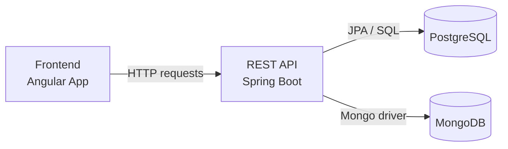

# Insurance Industry POC (Mock Project)

This is a mock project that resembles a few general concepts used in insurance industry systems.

It is intended for learning, demos, and experimentation only.

## What this project consists of

- Frontend: Angular UI for client registration flow.
- REST API: Spring Boot endpoints for handling client operations.
- Backend domain logic: services, repositories, and event handling.
- Database 1: PostgreSQL for relational insurance data (clients, policies, payments).
- Database 2: MongoDB for document-oriented data (e.g., logs/audit-style records).
- Infrastructure: Docker Compose setup for local databases.

## High-level architecture

