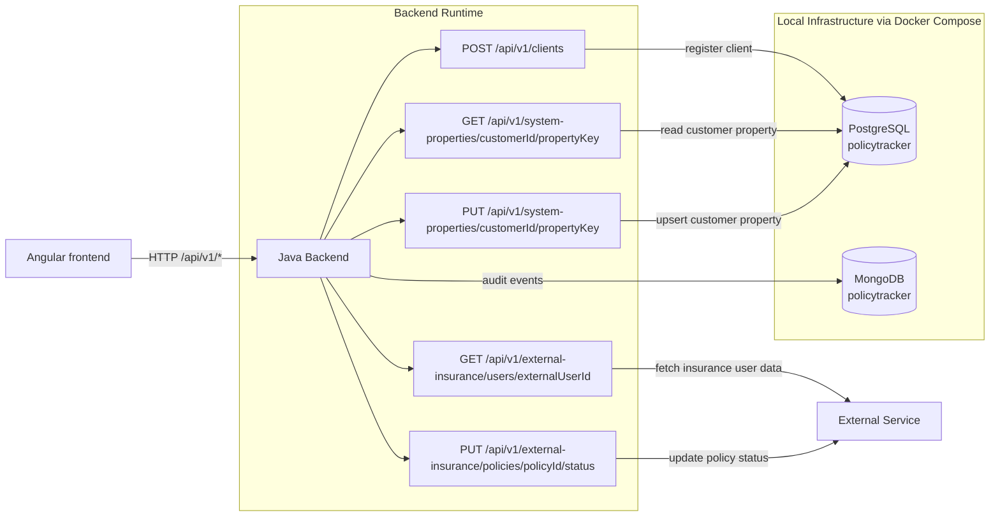

# Insurance Industry POC (Mock Project)

This is a POC project that resembles a few general concepts used in insurance industry systems.

It is intended for learning, demos, and experimentation only.

## What this project consists of

- Frontend: Angular UI for client registration flow.
- REST API: Spring Boot endpoints for handling client operations.
- Backend domain logic: services, repositories, and event handling.
- Database 1: PostgreSQL for relational insurance data (clients, policies, payments).
- Database 2: MongoDB for document-oriented data (e.g., logs/audit-style records).
- Infrastructure: Docker Compose setup for local databases.

## High-level architecture



## Backend tree

```text
backend/
├─ client/             REST API call handling
├─ audit/              MongoDB-backed audit event storage
├─ externalinsurance/  OpenAPI-based external service communication
├─ events/             domain event contracts/publishing
├─ requestcontext/     request-scoped user context + exception handling
├─ systemproperties/   JPA/PostgreSQL customer-scoped properties
├─ referencedataimport/ CSV import + tree building
└─ common/             shared contracts/markers
```
